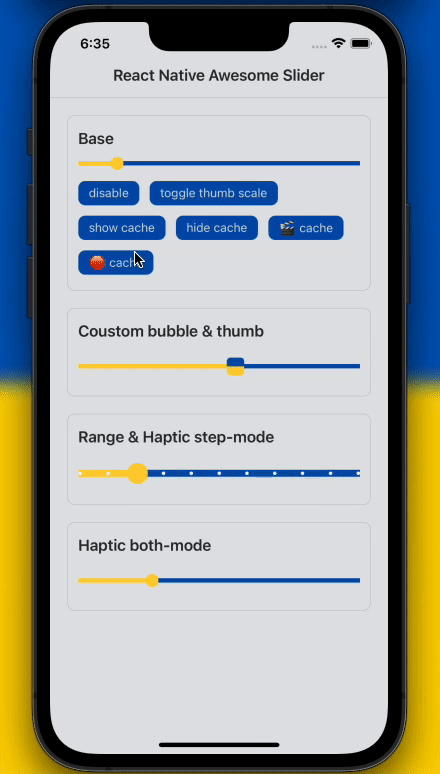

<div align="center">
  <blockquote><i>`JSThread` to `JSThread`, `UIThread` to `UIThread`.</i></blockquote>
  <h1 align="center">React Native Awesome Slider</h1>
  <h3 align="center">Typescript Slider component powered by Reanimated v2 and react-native-gesture-handler.</h3>
</div>


<div align="center">
  
  <br/> 
</div>

## Installation

First you have to follow installation instructions of [Reanimated v2](https://docs.swmansion.com/react-native-reanimated/) and [react-native-gesture-handler](https://docs.swmansion.com/react-native-gesture-handler/)

```sh
yarn add react-native-awesome-slider
```


## Example usage

```jsx
import { useSharedValue } from 'react-native-reanimated';
import { Slider } from 'react-native-awesome-slider';

export const Example = () => {
    const progress = useSharedValue(30);
    const min = useSharedValue(0);
    const max = useSharedValue(100);
    return (
        <Slider
            style={styles.container}
            progress={progress}
            minimumValue={min}
            maximumValue={max}
        />
    );
};
```

## Why use this library?

- Pure javascript slider implementations usually rely on `react-native`'s gesture events which may inadvertently trigger 'swipe to go back' events as you pan the slider. ❌
- Native sliders rely on state updates, which can cause performance issues. ❌

 `react-native-awesome-slider` relies on `reanimated`'s [ShareValue](https://docs.swmansion.com/react-native-reanimated/docs/fundamentals/shared-values) ability to run code directly in the `UIThread` to enhance performance, and `react-native-gesture-handle` won't interfere with your swiping gestures. ✨

## Features

- 100% written in `TypeScript`.
- 100% built upon `react-native-reanimated` and `react-native-gusture-handle`.
- Supports Tap & Pan triggering.
- and more...

## TODO list
- Add RTL support
- Optimize arrows
- Rewrite using `react-native-gesture-handle` v2
- ... 

## Configuration

The `<Slider/>` component has the following configuration properties:

| Name | Type | Description | Required | Default Value |
| --- | --- | --- | --- | --- |
| minimumTrackTintColor | string | color applied to track from the min position up to the thumb position  | ❌ | rgba(61, 219, 209, 1) |
| maximumTrackTintColor | string |  color applied to track from the thumb position up to the maximum position | ❌ | rgba(195, 197, 199, 1) |
| cacheTrackTintColor | string | cache track tint color | ❌ | rgba(39, 41, 46, 1) |
| style | ViewStyle |  | ❌ |  |
| borderColor | string | Color of the border of the slider, also you can use containerStyle . | ❌ | transparent |
| bubble | (number) => string | Get the current value of the slider as you slide it, and returns a string to be used inside the bubble. | ❌ | (number) => string |
| progress | Animated.SharedValue<number> | Current value of the slider | ✅ | 0 |
| cache | Animated.SharedValue<number> | Cache value of the slider | ❌ | 0 |
| minimumValue | Animated.SharedValue<number> | An Animated.SharedValue from react-native-reanimated library which is the minimum value of the slider. | ✅ | undefined |
| maximumValue | Animated.SharedValue<number> | An Animated.SharedValue from react-native-reanimated library which is the maximum value of the slider. | ✅ | undefined |
| onSlidingStart | () => void | Callback called when the sliding interaction starts | ❌ | undefined |
| onValueChange | (number) => void | Callback called when the slider value changes | ❌ | undefined |
| onSlidingComplete | (number) => void | Callback called when the sliding interaction stops. The updated slider value will be passed as argument | ❌ | undefined |
| renderBubble | () => React.ReactNode | A custom bubble component that will be rendered while sliding. | ❌ | See the <Bubble/> component |
| setBubbleText | (string) => void | This function will be called while sliding and can be used to update the text in a custom bubble component. | ❌ | current slider value |
| bubbleTranslateY | number | Value to pass to the container of the bubble as translateY | ❌ | 7 |
| renderThumbImage | () => React.ReactNode | Render custom thumb image. If you need to customize thumb, you also need to set the thumb width | ❌ | ReactNode |
| thumbWidth | number | Thumb elements width | ❌ | 15 |
| disable | boolean | Disable user interaction with the slider | ❌ | false |
| disableMinTrackTintColor | string | Disable slider color. Defaults to `minimumTrackTintColor` | ❌ | rgba(61, 219, 209, 1) |
| disableTapEvent | boolean | Enable tap event change value. Defaults to `true` | ❌ | true |
| bubbleMaxWidth | number | The maximum width of the bubble component | ❌ | 100 |
| bubbleTextStyle | TextStyle | Bubble text style | ❌ |  |
| bubbleContainerStyle | ViewStyle | Bubble container text style | ❌ |  |
| bubbleBackgroundColor | string | Bubble background color | ❌ | rgba(61, 219, 209, 1) |
| isScrubbing | Animated.SharedValue<boolean> | callback slider is scrubbing status | ❌ | undefined |
| onTap | () => void | A callback for when the slider is tapped.(Useful for video-player scrubbing.) | ❌ | undefined |
| thumbScaleValue | Animated.SharedValue<number> | Control thumb’s transform-scale animation. | ❌ | undefined |
| sliderHeight | number | The height of the slider component | ❌ | 30 |
| containerStyle | ViewStyle | styles to be applied to the slider container component | ❌ | { width: '100%', height: 5, borderRadius: 2, borderColor: borderColor, overflow: 'hidden', borderWidth: 1, backgroundColor: maximumTrackTintColor, }, |
| panHitSlop | { top?: number | undefined;left?: number | undefined;bottom?: number | undefined;right?: number | undefined;}| pan gesture hit slop | ❌ | { top: 8, left: 0, bottom: 8, right: 0,} |


