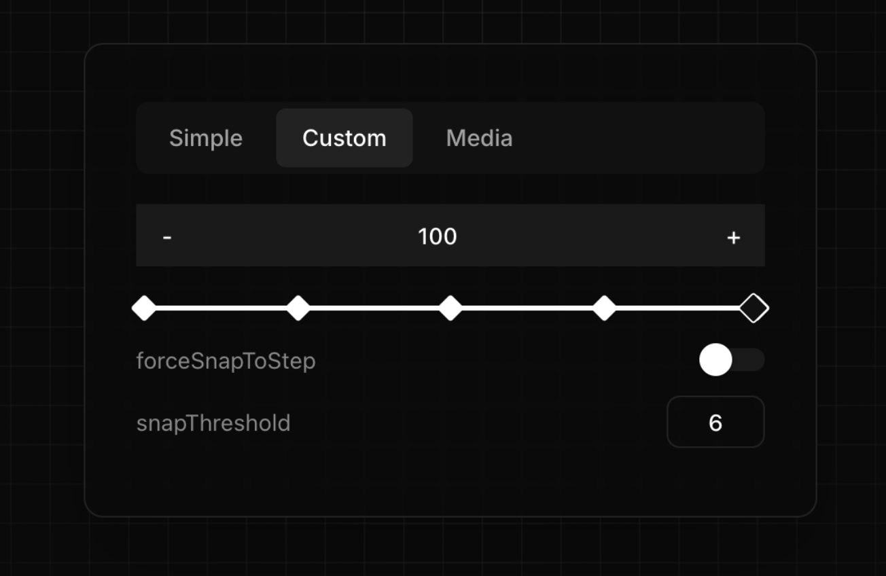

<div align="center">
  <h1 align="center">React Native Awesome Slider</h1>

[](https://www.npmjs.com/package/react-native-awesome-slider) [](https://www.npmjs.com/package/react-native-awesome-slider) [](https://www.npmjs.com/package/react-native-awesome-slider) [](https://slider.0xalt.xyz/)

  <p  align="center">A versatile, responsive react native and web slider component.</p>
    
  </div>

### Core Features

- Discrete sliding
- Continuous sliding
- Step control
- Snapping behavior

### Interaction

- Scrubbing control
- Haptic feedback

### Customization

- Custom thumb
- Custom bubble tooltip
- Custom mark
- Customizable appearance

### Use Cases

- Media Player Controls (video/audio progress, volume, playback speed)
- Financial Trading Tools (position size, leverage ratio)
- General Purpose (numeric value adjustment, settings configuration)

## Installation

First, install and configure [Reanimated v2](https://docs.swmansion.com/react-native-reanimated/) and [react-native-gesture-handler](https://docs.swmansion.com/react-native-gesture-handler/)

For react-native-gesture-handler version >= 2:

```sh
yarn add react-native-awesome-slider
```

For version < 2:

```sh
yarn add react-native-awesome-slider@1
```

## Basic Usage

```jsx
import { useSharedValue } from 'react-native-reanimated';
import { Slider } from 'react-native-awesome-slider';

export const Example = () => {
  const progress = useSharedValue(30);
  const min = useSharedValue(0);
  const max = useSharedValue(100);
  return <Slider progress={progress} minimumValue={min} maximumValue={max} />;
};
```

## Documentation

For complete component props and advanced usage, visit our [official documentation](https://slider.0xalt.xyz/).

## License

MIT © Alan Toa
